<p align="center">
  
</p>

<h1 align="center">Setting Up CI/CD with GitHub Actions</h1>

<p align="center"><b>A production-ready CI/CD template you can lift into any repo.</b> Working workflows for lint, test, build, deploy and security scanning — plus a sample app and ready-to-use templates for Node, Python, Docker and Kubernetes.</p>

<p align="center">
  
  
  
  <a href="LICENSE"></a>
</p>

---

## The pipeline

Three workflows cover the full loop:

- **`ci.yml`** — on every pull request: **lint** (ESLint) → **test** on a Node 18 + 20 matrix (Jest) → **build** with coverage uploaded to Codecov.
- **`cd.yml`** — on merge to `main`: **build & test** → **deploy to staging** (with smoke tests) → **deploy to production**, using GitHub Environments.
- **`security-scan.yml`** — on a weekly cron (and on push/PR): **npm audit**, **Snyk** (SAST) and **Trivy** (filesystem) scans.

## Copy, customize, ship

<p align="center">
  
</p>

| File | What it does |
|---|---|
| [`.github/workflows/ci.yml`](.github/workflows/ci.yml) | Lint → test (Node 18 & 20) → build + coverage, on every PR |
| [`.github/workflows/cd.yml`](.github/workflows/cd.yml) | Build → staging + smoke tests → production, on merge to main |
| [`.github/workflows/security-scan.yml`](.github/workflows/security-scan.yml) | npm audit · Snyk · Trivy, weekly + on push/PR |
| [`examples/python-ci.yml`](examples/python-ci.yml) | Flask/Django CI with pytest |
| [`examples/docker-build.yml`](examples/docker-build.yml) | Multi-stage build + push, image optimization |
| [`examples/k8s-deploy.yml`](examples/k8s-deploy.yml) | Kubernetes rolling deployment |

## Quick start

```bash
git clone https://github.com/ry-ops/setting-up-cicd-github-actions.git
cd setting-up-cicd-github-actions/app

npm install
npm test       # run the Jest suite
npm start      # sample Express app → http://localhost:3000
```

To use it in your own project:

1. Copy `.github/workflows/` into your repository (and any template from `examples/`).
2. Adjust triggers, Node versions, and deploy steps for your stack.
3. Add the required secrets below.
4. Open a PR — the pipeline runs itself.

## Required secrets

Set these under **Settings → Secrets and variables → Actions**:

| Secret | Used for |
|---|---|
| `DEPLOY_TOKEN` | Deployment authentication |
| `DOCKER_USERNAME` / `DOCKER_PASSWORD` | Docker Hub (if using Docker) |
| `KUBE_CONFIG` | Kubernetes config, base64-encoded (if using K8s) |
| `SNYK_TOKEN` | Snyk security scanning |

## What's inside

```
app/                       # sample Node/Express app with a Jest suite
.github/workflows/         # ci.yml · cd.yml · security-scan.yml
examples/                  # python-ci · docker-build · k8s-deploy templates
documentation/             # SETUP · WORKFLOWS · BEST-PRACTICES
```

## Documentation

- [SETUP.md](documentation/SETUP.md) — step-by-step setup for a new project
- [WORKFLOWS.md](documentation/WORKFLOWS.md) — each workflow explained
- [BEST-PRACTICES.md](documentation/BEST-PRACTICES.md) — optimization & tips
- [GitHub Actions docs](https://docs.github.com/en/actions) · [workflow syntax](https://docs.github.com/en/actions/using-workflows/workflow-syntax-for-github-actions)

## License

MIT. See [LICENSE](LICENSE).

<!-- org-footer -->
---

<p align="center"><sub>Part of <a href="https://github.com/ry-ops">ry-ops</a> · building the pipes between infrastructure, automation, and observability · built by <a href="https://github.com/ry-ops">ry-ops</a></sub></p>
